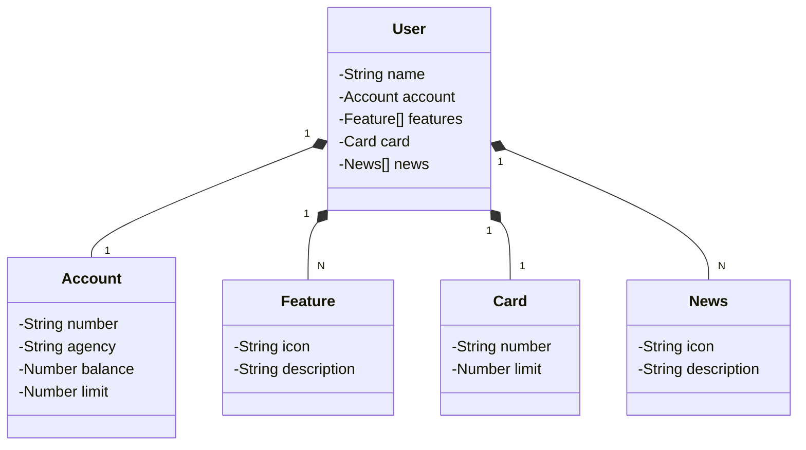

Daily Learning

# API REST Spring Boot3 Java Railway

Project developed during the Santander 2023 Bootcamp - Java Backend, under the guidance of specialist [Venilton FalvoJr](https://github.com/falvojr "Venilton FalvoJr").
Learning to use Java 17 (LTS) to take advantage of the language's innovations and Spring Boot 3 to maximize productivity through autoconfiguration.
The persistence layer was implemented with Spring Data JPA, facilitating integration with SQL databases (such as PostgreSQL), while API documentation was automated with OpenAPI (Swagger).
Finally, we completed the cycle with cloud deployment using Railway.

## Technologies

- Java 17: We will use the latest LTS version of Java to take advantage of the latest innovations that this robust and widely used language offers;
- Spring Boot 3: We will work with the newest version of Spring Boot, which maximizes developer productivity through its powerful auto-configuration premise;
- Spring Data JPA: We will explore how this tool can simplify our data access layer, facilitating integration with SQL databases;
- OpenAPI (Swagger): We will create effective and easy-to-understand API documentation using OpenAPI (Swagger), perfectly aligned with the high productivity that Spring Boot offers;
- Railroad: facilitates the deployment and monitoring of our solutions in the cloud, in addition to offering several databases as a service and CI/CD pipelines.

## [Figma](https://www.figma.com/file/0ZsjwjsYlYd3timxqMWlbj/SANTANDER---Projeto-Web%2FMobile?type=design&node-id=1421%3A432&mode=design&t=6dPQuerScEQH0zAn-1)

- Figma was used to abstract the domain of this API, being useful in the analysis and design of the solution.

## [Diagram](/docs/diagram.png)



## Architecture

```Markdown
santander_dev_week_2023_api/
├─ .gradle/
├─ docs/
│  ├─ icons/
│  └─ mocks/
│     └─ find_one.json
├─ gradle/wrapper/
├─ src/
│  ├─ main/
│  │  ├─ java/
│  │  │  └─ me/dio/
│  │  │     ├─ domain/
│  │  │     │  ├─ model/
│  │  │     │  │  ├─ Account.java
│  │  │     │  │  ├─ BaseItem.java
│  │  │     │  │  ├─ Card.java
│  │  │     │  │  ├─ Feature.java
│  │  │     │  │  ├─ News.java
│  │  │     │  │  └─ User.java
│  │  │     │  └─ repository/
│  │  │     │     └─ UserRepository.java
│  │  │     ├─ controller/
│  │  │     │  ├─ dto/
│  │  │     │  │  ├─ AccountDto.java
│  │  │     │  │  ├─ CardDto.java
│  │  │     │  │  ├─ FeatureDto.java
│  │  │     │  │  ├─ NewsDto.java
│  │  │     │  │  └─ UserDto.java
│  │  │     │  ├─ exception/
│  │  │     │  │  └─ GlobalExceptionHandler.java
│  │  │     │  └─ UserController.java
│  │  │     ├─ service/
│  │  │     │  ├─ exception/
│  │  │     │  │  ├─ BusinessException.java
│  │  │     │  │  └─ NotFoundException.java
│  │  │     │  ├─ impl/
│  │  │     │  │  ├─ CrudService.java
│  │  │     │  │  └─ UserServiceImpl.java
│  │  │     │  └─ UserService.java
│  │  │     └─ Application.java
│  │  └─ resources/
│  │     ├─ application-dev.yml
│  │     └─ application-prd.yml
│  └─ test/
│     └─ java/
│        └─ me/dio/
│           └─ ApplicationTests.java
├─ build.gradle
├─ gradlew
├─ gradlew.bat
├─ settings.gradle
├─ README.md
└─ LICENSE
```

[LICENSE](/LICENSE)

## Repository original

See [original repository](https://github.com/digitalinnovationone/santander-dev-week-2023-api)
